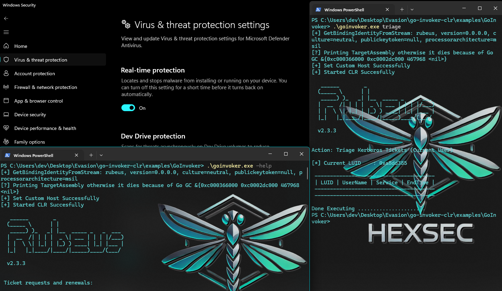
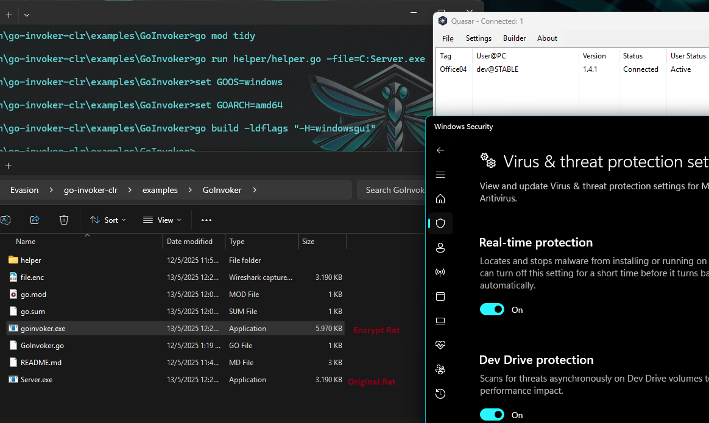
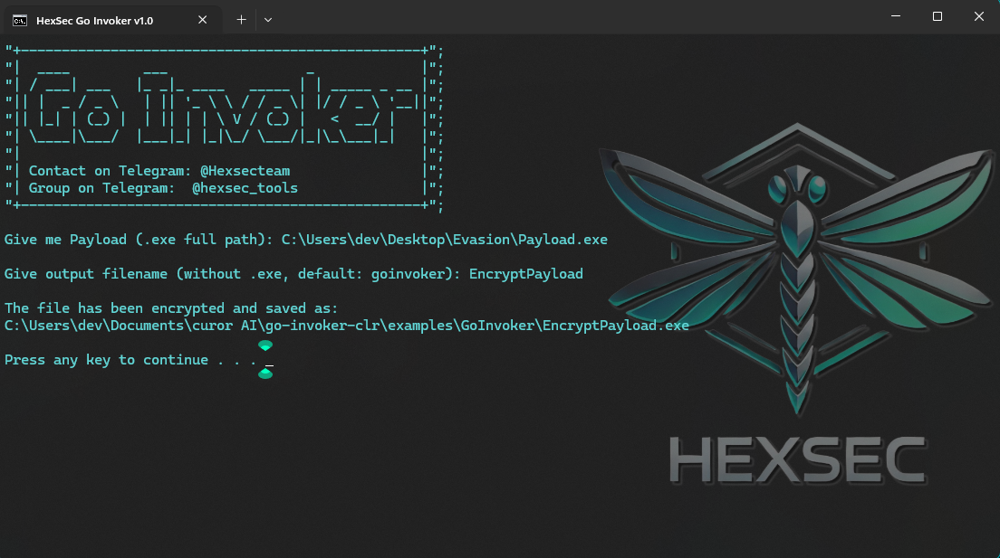

# Example Usage - Go Invoker

This will use go to be a good CLR Host for the exe. It will

- Hide The malicious .NET via a simple XOR Decryption
- Start a Good CLR Host and load Assembly with Load2 - Natively bypassing AMSI

Before anything else, make sure that the Go programming language is installed on your system: [Download Go](https://go.dev/dl/)

For example, we'll demonstrate how to build this for both Rubeus and Quasar RAT. Just cd into this directory and run:


### Linux:
```bash
cd examples/GoInvoker
go mod tidy
go run helper/helper.go -file=/home/kali/Desktop/Server.exe && GOOS=windows GOARCH=amd64 go build
```
### Windows:
```bash
cd examples/GoInvoker
go mod tidy
go run helper/helper.go -file=C:\...\Server.exe
set GOOS=windows
set GOARCH=amd64
go build                          # build with console output (console app)
go build -ldflags "-H=windowsgui" # build without console window (silent GUI mode)

```
You will get a `goinvoker.exe` that you can use like `Server.exe` whith native AMSI bypass without memory patching:

```powershell
.\goinvoker.exe triage
.\goinvoker.exe -help
```
### Test with Rubeus:


### Test with Quasar RAT:


## Example Usage - Go Invoker Graphical Interface

For users who prefer a more user-friendly experience, a graphical interface is available in the form `GoInvoker.bat` script. This script automates the build process by executing the Go commands listed above, making it easier to compile the project without manually using the command line. 

When you run the script, it will prompt you for input such as the output executable name and target path. If no name is provided, a default name (`goinvoker.exe`) will be used. Providing a valid path is required to proceed.

This solution is ideal for those who want a quick and easy way to build the project with minimal interaction.

**Note:** The script is designed for Windows environments.



## Motivation of Go Invoker

Basically we all noticed that a while ago, defender introduced behavioral rules to prevent AMSI memory patching.

Thanks to IBM X-Force Red, we got a patchless AMSI bypass that does not rely on the CPU like for Hardware Break Point !!
## References

- 📄 **IBM X-Force Red** —  
  _Being a Good CLR Host: Modernizing Offensive .NET Tradecraft_  
  [Read the article](https://www.ibm.com/think/x-force/being-a-good-clr-host-modernizing-offensive-net-tradecraft)

- 📄 **NTT Data Security Research** —  
  _Radar Magazine Supplement – July 2024 (PDF)_  
  [Download the report](https://www.nttdata.com/global/en/-/media/nttdataglobal/1_files/services/cybersecurity/radar_magazine/2024/radar_supplement_july.pdf?rev=95736bd059584c05a31ef61eec8b83dd)

## 🤝 Support the HexSec Community
If you find value in our work and would like to support the HexSec community, you can contribute by making a donation. Your support helps us continue developing innovative and high-quality tools for the cybersecurity and IT community.

**Donate:**
- **ETH**: `0x3E79B73e3ce33c6B860425DCB40c6D2f4F2aC508`
- **BTC**: `bc1qpex9u7x4a6kj4nf6fee7mz54vsv4th2rj2pt30`

---

## 📬 More Details:
- Contact on Telegram: [@Hexsecteam](https://t.me/Hexsecteam)
- Group on Telegram: [@hexsec_tools](https://t.me/hexsec_tools)
- Vimeo: [https://vimeo.com/hexsec](https://vimeo.com/hexsec)
- Dailymotion: [https://dailymotion.com/hexsectools](https://dailymotion.com/hexsectools)
- Medium: [https://medium.com/@hexsectools](https://medium.com/@hexsectools)
- Facebook: [https://www.facebook.com/hexsexcommunity/](https://www.facebook.com/hexsexcommunity/)
- YouTube: [https://www.youtube.com/@hex_sec](https://www.youtube.com/@hex_sec)

---

> ⚠️ This project is provided for **educational and ethical hacking purposes only**. You are responsible for any use. Unauthorized access or distribution is 
